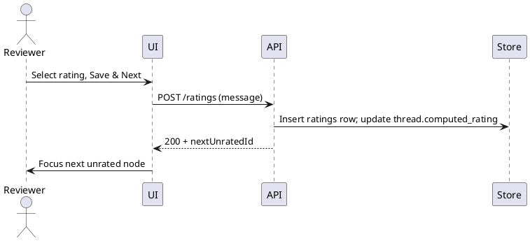

# SPEC-1-Email Thread Tree Navigation UI

## Background

Primary persona: **legal reviewer** working through large email corpora for discovery. Their main job is to open each message in a thread, understand context, and **rate** (e.g., Relevant/Irrelevant, Privileged, Confidential) with an auditable trail. Flat conversation views force repeated context-building and make it slow to jump to the next unrated or relevant branch.

**Why now**
- Review teams waste time re-reading long, forked threads to find decision points or the node that changed recipients.
- Traditional eDiscovery tools list messages chronologically but rarely expose a true **parent–child tree** with fast keyboard-driven traversal and “next unrated” jumps across branches.

**Updated assumptions** (to be validated)
- Dataset comes from exported sources (PST/MBOX/EML) or prior processing, not live inboxes.
- Web-first review UI; desktop later. Mobile out-of-scope for v1.
- Typical matter: 50k–500k emails; thread size 5–120 nodes; worst case 400.
- Performance target: tree render < 200 ms for 100 nodes; next-unrated navigation < 100 ms.

---

## Requirements

MoSCoW priorities for a **Legal Review Thread Navigator**

**Must have**
- **Hierarchical thread view** with clear parent–child edges; nodes show sender initials/avatar, timestamp, and icons for attachments/forward/reply-all.
- **State encoding** on nodes: unread, rated, my-turn (addressed to custodian/reviewer), has attachments, potential privilege flag.
- **Fast navigation**: keyboard shortcuts (↑/↓/←/→ to traverse), Space/Enter to open, `N` = next unrated in thread, `Shift+N` = prev.
- **Rating panel** docked to the right with one-tap options and notes; auto-save and **auto-advance** to next unrated.
- **Message pane** with full headers, body, inline quote-collapse, and attachment preview (PDF/images at minimum).
- **Branch controls**: expand/collapse subtree, “focus mode” on a branch, and mini-map to jump along the timeline.
- **Search & filters** within thread: by participant, date slice, has attachment, contains term (pre-indexed), rating state.
- **Audit & provenance**: immutable log of rating changes (who/when/what), view-only for auditors.
- **Bulk export** of ratings and notes per matter (CSV/JSON + load-file compatible formats) with thread/node identifiers.
- **Access control**: matter-level RBAC; encryption in transit/at rest.
- **Performance** targets as in Background; smooth pan/zoom for up to 400 nodes.
- **A11y**: screen-reader friendly labels, focus order, and WCAG-compliant contrasts.

**Should have**
- **Batch actions**: rate entire branch with confirmation; multi-select.
- **Attachment viewers** for common Office types via server-side rendering.
- **Recipient-change markers** (visual chips where To/CC changes) and **decision-point badges** (first message that mentions a tracked term).
- **Dedup/near-dup hints** within thread to avoid re-rating duplicates.
- **Reviewer comments** per node with @mentions.

**Could have**
- Smart suggestions (privilege/relevance) with low-latency hints and explainable reasons.
- Timeline analytics (which branches carry most relevant messages).
- Offline queue for ratings when disconnected.

**Won’t have (v1)**
- Compose/reply features; email sending.
- Native mobile app.
- Live sync to custodians’ mailboxes (ingestion pipeline handles sources instead).

## Method

### A. UI Frame (focused on rating)
- **Left:** Thread tree (pan/zoom, unread/rated badges).
- **Center:** Message view (full headers, quote folding, attachment chips).
- **Right:** **Rating Panel** with two scopes:
  1) **Thread rating** (computed roll‑up with optional reviewer override + justification).
  2) **Message rating** (the item you’re on). Auto‑save + auto‑advance to next **unrated**.

### B. Pluggable Rating System (component + config)
Provide your own taxonomy via a JSON schema. Minimal types:

```ts
// rating-schema.ts
export type RatingKey = string; // e.g., "relevant", "privileged", "confidential"

export type RatingOption = {
  key: RatingKey;
  label: string;
  description?: string;
  severity?: number; // 0..100 used for roll-up comparisons
  color?: string; // tailwind class or hex
  exclusiveGroup?: string; // options in same group are mutually exclusive
  requiresNote?: boolean; // force justification
};

export type RatingSchema = {
  version: string;              // bump when taxonomy changes
  messageOptions: RatingOption[]; // per-email options
  threadOptions?: RatingOption[];  // optional thread-only options
  rollupPolicy?: {
    mode: "maxSeverity" | "rules";
    rules?: Array<{ ifAny: RatingKey[]; thenThread: RatingKey }>; // e.g., ifAny:["privileged"] -> thenThread:"privileged"
  };
};
```

**React component (drop-in):**
```tsx
// RatingPanel.tsx
import { useState, useEffect } from "react";

export type MessageRating = {
  messageId: string;
  selected: RatingKey[]; // may be 1+ unless exclusiveGroup enforces 1
  note?: string;
  version: number;
  updatedBy: string;
  updatedAt: string;
};

export type ThreadRating = {
  threadId: string;
  selected: RatingKey[]; // computed then optionally overridden
  source: "computed" | "override";
  note?: string;
};

export function RatingPanel({
  schema,
  messageRating,
  threadRating,
  onChangeMessage,
  onChangeThread,
  autoAdvance,
}: {
  schema: RatingSchema;
  messageRating: MessageRating;
  threadRating: ThreadRating;
  onChangeMessage: (r: MessageRating) => void;
  onChangeThread: (r: ThreadRating) => void;
  autoAdvance?: () => void; // call after save
}) {
  const [mr, setMr] = useState(messageRating);
  useEffect(() => setMr(messageRating), [messageRating]);

  const toggle = (key: RatingKey) => {
    const opt = schema.messageOptions.find(o => o.key === key);
    let next = new Set(mr.selected);
    const inGroup = opt?.exclusiveGroup;
    if (inGroup) {
      // remove others in group
      schema.messageOptions
        .filter(o => o.exclusiveGroup === inGroup)
        .forEach(o => next.delete(o.key));
    }
    next.has(key) ? next.delete(key) : next.add(key);
    setMr({ ...mr, selected: [...next] });
  };

  const save = () => {
    const needsNote = mr.selected.some(k => schema.messageOptions.find(o => o.key===k)?.requiresNote);
    if (needsNote && !mr.note) return alert("Please add justification.");
    onChangeMessage({ ...mr, version: mr.version + 1, updatedAt: new Date().toISOString() });
    autoAdvance?.();
  };

  return (
    <div className="w-80 p-4 space-y-4">
      {/* Thread section */}
      <section className="rounded-2xl shadow p-3">
        <h3 className="font-semibold mb-2">Thread Rating</h3>
        <div className="flex flex-wrap gap-2">
          {(schema.threadOptions ?? schema.messageOptions).map(o => (
            <button key={o.key}
              className={`px-2 py-1 rounded-full border text-sm ${threadRating.selected.includes(o.key)?"bg-black text-white":""}`}
              onClick={() => {
                const inGroup = o.exclusiveGroup;
                let next = new Set(threadRating.selected);
                if (inGroup) {
                  (schema.threadOptions ?? schema.messageOptions)
                    .filter(x => x.exclusiveGroup === inGroup)
                    .forEach(x => next.delete(x.key));
                }
                next.has(o.key) ? next.delete(o.key) : next.add(o.key);
                onChangeThread({ ...threadRating, selected: [...next], source: "override" });
              }}
            >{o.label}</button>
          ))}
        </div>
        <textarea className="w-full mt-2 border rounded p-2" placeholder="Thread note (required if policy demands)"
          value={threadRating.note ?? ""}
          onChange={e => onChangeThread({ ...threadRating, note: e.target.value, source: "override" })} />
      </section>

      {/* Message section */}
      <section className="rounded-2xl shadow p-3">
        <h3 className="font-semibold mb-2">Message Rating</h3>
        <div className="flex flex-wrap gap-2">
          {schema.messageOptions.map(o => (
            <button key={o.key}
              className={`px-2 py-1 rounded-full border text-sm ${mr.selected.includes(o.key)?"bg-black text-white":""}`}
              onClick={() => toggle(o.key)}
            >{o.label}</button>
          ))}
        </div>
        <textarea className="w-full mt-2 border rounded p-2" placeholder="Note (auto-required for some choices)"
          value={mr.note ?? ""}
          onChange={e => setMr({ ...mr, note: e.target.value })} />
        <div className="flex justify-end gap-2 mt-2">
          <button className="px-3 py-1 rounded border" onClick={save}>Save & Next</button>
        </div>
      </section>
    </div>
  );
}
```

**Roll‑up computation (server or client):**
```ts
export function computeThreadFromMessages(schema: RatingSchema, messageRatings: MessageRating[]): RatingKey[] {
  if (schema.rollupPolicy?.mode === "rules" && schema.rollupPolicy.rules) {
    const present = new Set(messageRatings.flatMap(r => r.selected));
    for (const rule of schema.rollupPolicy.rules) {
      if (rule.ifAny.some(k => present.has(k))) return [rule.thenThread];
    }
  }
  // default: max by severity
  const all = messageRatings.flatMap(r => r.selected);
  const byKey = new Map(schema.messageOptions.map(o => [o.key, o.severity ?? 0] as const));
  const top = all.sort((a,b) => (byKey.get(b)??0) - (byKey.get(a)??0))[0];
  return top ? [top] : [];
}
```

### C. Data model (MVP)
- **threads**(`thread_id`, `subject_norm`, `root_message_id`, `review_status`, `computed_rating[]`, `override_rating[]`, `override_note`, `last_reviewed_at`, `last_ingest_at`)
- **messages**(`message_id`, `thread_id`, `rfc_message_id`, `date`, `from`, `to`, `cc`, `bcc`, `subject`, `has_attach`, `hash_body`, `in_reply_to`, `references[]`)
- **message_edges**(`parent_message_id`, `child_message_id`) // for fast tree render
- **ratings**(`rating_id`, `scope` ENUM('message','thread'), `target_id`, `schema_version`, `selected[]`, `note`, `source` ENUM('user','computed'), `user_id`, `created_at`)
- **audit_log**(`audit_id`, `entity`, `entity_id`, `action`, `payload_json`, `user_id`, `ts`)
- **import_batch**(`batch_id`, `matter_id`, `ingested_at`, `source`, `hash`, `stats_json`)

Indexes: (`thread_id`), (`target_id`,`scope`), (`in_reply_to`), GIN on arrays for search.

### D. Incremental discovery (new emails arrive)
1. **Idempotent threading**
   - Identity = RFC `Message-ID`; if missing, use `(date, from, to+cc, subject_norm, sha256(body))`.
   - Parent discovery via `In-Reply-To`/`References`; fallback subject heuristics.
2. **Merge**
   - Insert new `messages` and `message_edges`; recompute `computed_rating` with `computeThreadFromMessages`.
3. **Staleness + tasks**
   - If thread has **new unrated messages** *or* roll-up changed, set `review_status='needs_review'` and create a **Review Task** at the first new node.
4. **UI indicators**
   - New nodes: blue dot + "New since last review" gutter line.
   - Thread pill: `Needs review` badge; `N` jumps to the next **unrated/new**.
   - Previously rated nodes remain locked unless user edits.
5. **Versioning**
   - Keep all `ratings` rows; last row per scope is current. The message view shows history with diffs.

### E. PlantUML (entities + flows)

```plantuml
@startuml
class Thread { thread_id; subject_norm; computed_rating; override_rating; review_status }
class Message { message_id; thread_id; rfc_message_id; in_reply_to; date }
class Rating { rating_id; scope; target_id; selected[]; note; source; user_id; created_at }
class ImportBatch { batch_id; ingested_at; source }
Thread "1" -- "*" Message
Message "1" --> "*" Message : parent-child
Message "1" -- "*" Rating : message ratings
Thread "1" -- "*" Rating : thread ratings
@enduml
```



---


(TBD after confirmation)

## Milestones

(TBD after confirmation)

## Gathering Results

(TBD after confirmation)

## Need Professional Help in Developing Your Architecture?

Please contact me at [sammuti.com](https://sammuti.com) :)

